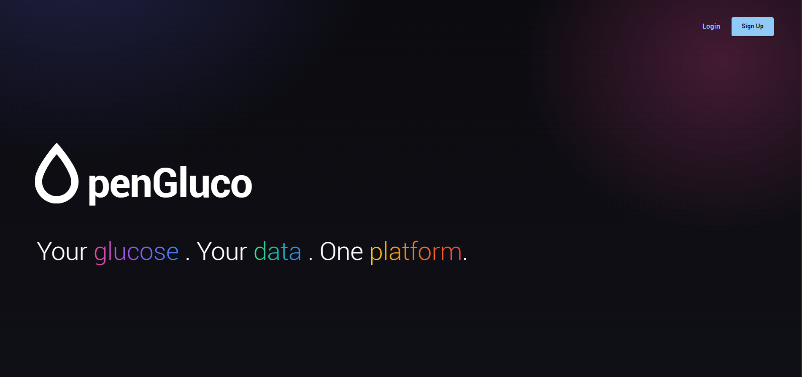
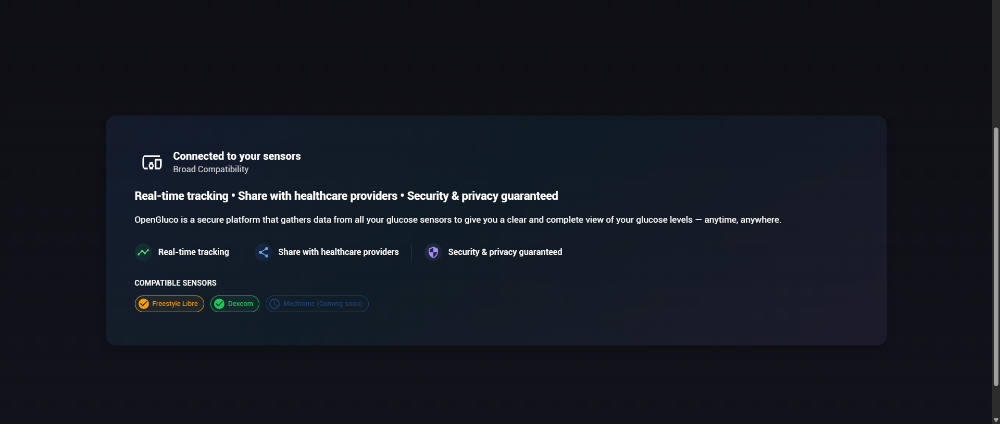
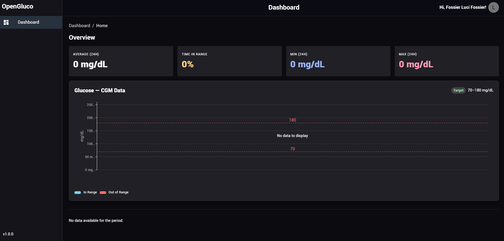
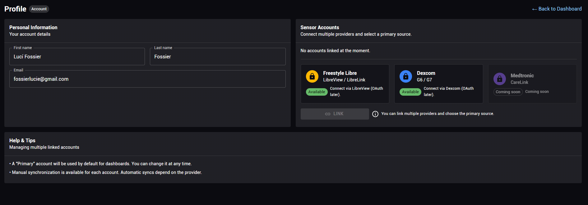

# OpenGluco

OpenGluco est une plateforme open source permettant de **centraliser, normaliser et visualiser des données de glycémie** provenant de différentes sources.

Le projet est composé de trois parties principales :

* **Portal** : frontend développé avec React, TypeScript, Material UI et Tailwind CSS.
* **API** : API développée en Python permettant de gérer les données et les échanges avec le frontend.

Les données sont stockées avec **PostgreSQL** et **InfluxDB**.

## Technologies

**Frontend**

* React
* TypeScript
* Material UI
* Tailwind CSS

**Backend**

* Python
* API REST

**Database**

* PostgreSQL
* InfluxDB

## Fonctionnalités

* Centralisation des données de glycémie
* Normalisation des données provenant de différentes API
* Stockage des données
* Visualisation des données glycémiques
* Graphiques interactifs
* Architecture séparée entre frontend, API et serveur

## Captures d'écran

### HOME

### Visualisation des données

### Gestion des données

## Projet

OpenGluco est développé dans le cadre d'un projet open source à l'**Université de Žilina, en Slovaquie**.
